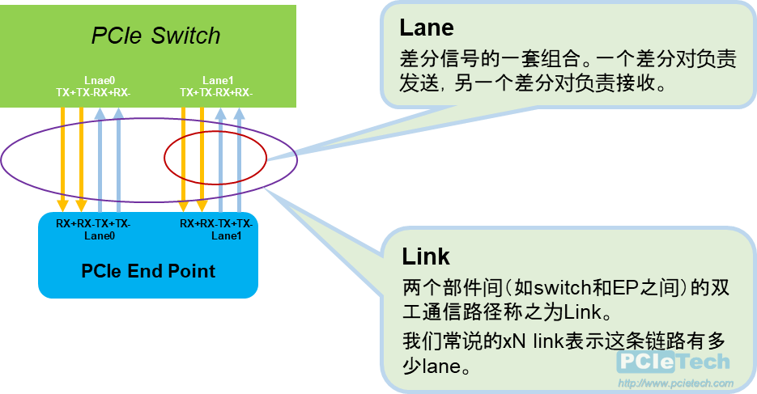

# Lane和Link

我们常说某个PCIe链路是X4、X8的，到底表示什么意思呢？

从协议看，协议定义了Link和Lane。

**Link**: The collection of two Ports and their interconnecting Lanes. A Link is a dualsimplex communications path between two components.

**Lane**: A set of differential signal pairs, one pair for transmission andone pair for reception. A by-N Link is composed of N Lanes.

在PCIe（Peripheral Component Interconnect Express）总线中，“通道”是指数据传输的路径。每个Lane（通道）包含四条线。这四条线分为两对，每对负责一个方向的数据传输。PCIe总线中每个lane都采用差分信号进行传输，包含一对发送差分信号对和一对接收差分信号对，这样会导致设备的引脚数增加一倍，但其收益非常明显：提高噪声容限、降低信号电压。

- **Tx+ 和 Tx-**：这对线用于发送数据（Transmit），即从设备向总线发送数据。

- **Rx+ 和 Rx-**：这对线用于接收数据（Receive），即从总线向设备接收数据。

每个PCIe Lane实际上是一个全双工的通信通道，可以同时进行数据的发送和接收。这种设计使得PCIe能够提供高速的数据传输能力。

PCIe x1、x2、x4、x8和x16表示的是PCIe总线使用的通道数。通道数的增加意味着可以同时传输更多的数据，从而提高总线的带宽。例如，PCIe x16的带宽是PCIe x1的16倍，因为它有16个独立的通道，每个通道都可以同时进行数据传输。

所谓的Lane，是指一组差分信号的组合，包括发送和接收。一个发送方向的差分信号包括TX+和TX-两条线，接收亦然。所以一条lane有四条物理连线。发送和接收是同时进行的，故为全双工。

所谓的Link，是指两个PCIe部件的链接，通常是由端口和lane组成。（通常有多条lane）比如我们有一个X2的链路，意思是指这条链路是两条lane组成，一共8条物理连线。链路上传送的是编码之后的数据，比如Gen1/Gen2所采用的8b/10b编码，Gen3之后改成了128b/130b编码。Link初始化以及link建立过程（或者称之为链路训练，Link Training）是在设备上电或者链路重新建立链接是发生的。

多条lane组成的link，有效的扩展了link的带宽。Lane的初始化和多条lane的组合优化，是在link的初始化训练过程中实现的。

### 参考

1. https://www.pcietech.com/124.html/

