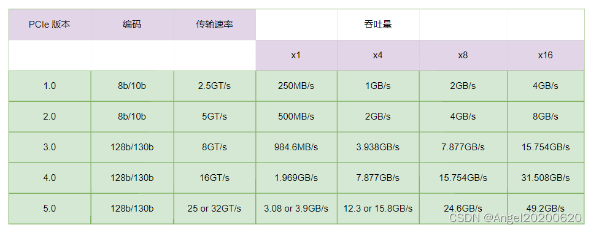

# 带宽的计算

**简介：** 我们在接触PCIe设备时会接触到一个词，传输速率，比如8GT/s。或者有人问你设备的带宽多少？通信速率多少？带你了解下。

**Speed(速率)**：通常用2.5GT/s、5GT/s、8GT/s，表示每条lane上的传输速率。PCIe1.0为2.5GT/s，PCIe2.0为5GT/s，PCIe3.0为8GT/s。

**Width(带宽)**：通常用x1、x2、x4、x8等表示，表示该链路由几条lane组成。

事实上，关于带宽计算，看起来很简单，实际上很容易弄错，即使算对了其中的几个基本概念还是容易搞混淆。这里特别梳理一下：通常我们对于高速链路的数据传输速率的单位是Gbps（*Gigabitsper second*）,即链路上每秒传输千兆个bit。当然，也有GBps（*Gigabytesper second*）。差别在于一个是小写的b，一个是大写的B，即：GBps = Gbps/8。两者还可以写成Gb/s和GB/s。

**GT/s** —— Giga transfers per second （千兆传输/秒），即每一秒内传输的次数。

**Gb/s** —— Giga Bits Per Second （千兆位/秒）。GT/s 与Gbps 之间不存在成比例的换算关系。

Gbps和GT/s的差异是啥？GT/s描述的是链路上传输的原始数据，Gb/s描述的是链路上传输的有效数据。

原始数据和有效数据的差异是啥？

还记得PCIe 2.0采用的8b/10b编码么? 原始数据是10b，其中有效数据只有8b。故Gb/s= GT/s \*（8/10）。PCIe3.0情况下，则：Gbps = GT/s \* （128/130）。

PCIe 链路吞吐量计算方法： 吞吐量 = 速率 \* 编码方式 * 带宽  

例如：PCI-e2.0 协议支持 5.0 GT/s，即每一条Lane 上支持每秒钟内传输 5G个bit；但这并不意味着 PCIe 2.0协议的每一条Lane支持 5Gbps 的速率。为什么这么说呢？因为PCIe 2.0 的物理层协议中使用的是 8b/10b 的编码方式。 即每传输8个bit，需要发送10个bit；这多出的2个bit并不是对上层有意义的信息。那么， PCIe 2.0协议的每一条Lane支持 5 * 8 / 10 = 4 Gb/s 的速率。以一个PCIe 2.0 x8的通道为例，该链路的吞吐量 = (5GT/s) * ( 8b/10b)  * 8  = 32 Gb/s = 4GB/s。

同理，PCI-e3.0 协议支持 8.0 GT/s, 即每一条Lane 上支持每秒钟内传输 8G个Bit。而PCIe 3.0 的物理层协议中使用的是 128b/130b 的编码方案。 即每传输128个bit，需要发送130个bit。那么， PCIe 3.0协议的每一条Lane支持 8 * 128 / 130 = 7.877 Gb/s = 984.6 MB/s 的速率。以PCIe 3.0 x8的通道为例，该链路的吞吐量 = (8GT/s) * (128b/130b) * 8 = 63.015 Gb/s = 7.877 GB/s。

**参考**

1. [https://www.pcietech.com/124.html/](https://www.pcietech.com/124.html/)
1. [https://community.fs.com/article/pcie-card-selection-guide.html](https://community.fs.com/article/pcie-card-selection-guide.html)
1. [https://blog.csdn.net/sinat_43629962/article/details/123729771](https://blog.csdn.net/sinat_43629962/article/details/123729771)
